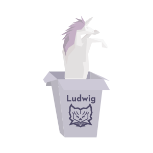
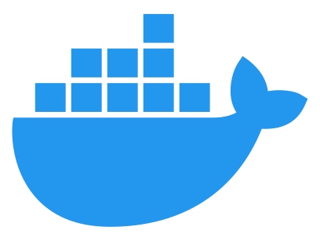

# Search n' explore your data

Ludwig allows user's to interface with a query language to visually compose queries. Ludwig let's you visually explore the data which returns.

## What's inside the box

Some technologies which create the magic inside of Ludwig are JWT Authentication with an Access and a Refresh token using Node.js, TypeScript, MongoDB, Redis, and Docker with Kubernetes for orchestration. Ludwig also uses OpenApi to deliver his documentation via Swagger.

Additional frontend and backend technologies to enhance the user's experience and each are located within the package.json file in the root of each project directory.

  

## Some high level topics of implementation

- JWT Refresh Token with Node.js, TypeScript, and MongoDB Overview
- JWT Refresh Token Implementation Flow
- Generate Public and Private Keys for the Token
- Update Environment Variables in Config
- Update the Sign and Verify JWT Utility Functions
- Update the Sign Token Service Function
- Update the Login Controller
- Create a Controller to Refresh Access Token
- Create a Controller to Logout User
- Update the Authentication Routes
- Update app.ts

## Getting to know Ludwig

### Running Ludwig is simple

`docker compose up`

### Exec'ing into Docker's Mongo container and exploring Ludwig's user data

`docker container ls`
`docker exec -it <mongo_container_id> bash`
`mongosh`
`use admin`
`db.auth(<username>, <password>)`
`use ludwigDb`
`db.users.find()`

### Steps to deploy and manage Ludwig via K8s

`Stay tuned`

## Ludwig was born from this tech:

[Most of these logos were found on https://iconduck.com/]: #

 

 

 

